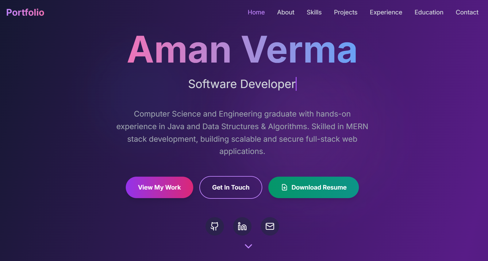

# 🚀 Aman Verma - Software Developer Portfolio

A modern, responsive, and interactive portfolio website built with React, TypeScript, and Tailwind CSS. This portfolio showcases my skills, projects, and professional experience as a Software Developer.



## 🚀 Live Demo

**[View Live Portfolio](https://aman-verma-portfolio.vercel.app/)** 🎉

Your portfolio is live and ready to showcase your work!

## ✨ Features

- **🎨 Modern Design**: Clean, professional, and responsive design with smooth animations
- **📱 Fully Responsive**: Optimized for all devices (desktop, tablet, mobile)
- **⚡ Fast Performance**: Built with Vite for lightning-fast development and builds
- **🎯 Interactive Navigation**: Smooth scrolling navigation with active section highlighting
- **📧 Contact Form**: Functional contact form with EmailJS integration
- **🔗 Live Project Links**: Direct links to deployed projects
- **🌙 Dark Theme**: Beautiful dark theme with gradient accents
- **📊 Animated Elements**: Engaging animations and hover effects
- **♿ Accessible**: Built with accessibility best practices

## 🛠️ Tech Stack

### Frontend
- **React 18** - Modern React with hooks
- **TypeScript** - Type-safe JavaScript
- **Vite** - Fast build tool and dev server
- **Tailwind CSS** - Utility-first CSS framework
- **Lucide React** - Beautiful icon library

### Styling & Animation
- **CSS3** - Custom animations and transitions
- **Gradient Backgrounds** - Modern gradient designs
- **Responsive Grid** - CSS Grid and Flexbox layouts
- **Smooth Scrolling** - Native smooth scroll behavior

### Email Service
- **EmailJS** - Client-side email service integration


## 📦 Installation & Setup

### Prerequisites
- Node.js (v16 or higher)
- npm or yarn package manager

### 1. Clone the Repository
```bash
git clone https://github.com/amanverma20/portfolio.git
cd portfolio
```

### 2. Install Dependencies
```bash
npm install
# or
yarn install
```

### 3. Environment Variables (Optional)
Create a `.env` file in the root directory for EmailJS configuration:

```env
VITE_EMAILJS_SERVICE_ID=your_service_id
VITE_EMAILJS_TEMPLATE_ID=your_template_id
VITE_EMAILJS_PUBLIC_KEY=your_public_key
```

### 4. Start Development Server
```bash
npm run dev
# or
yarn dev
```

Open [http://localhost:5173](http://localhost:5173) to view it in the browser.

## 🏗️ Build for Production

### Build the Project
```bash
npm run build
# or
yarn build
```

### Preview Production Build
```bash
npm run preview
# or
yarn preview
```

The build artifacts will be stored in the `dist/` directory.

## 📁 Project Structure

```
portfolio/
├── public/
│   └── aman.jpg                 # Profile image
├── src/
│   ├── App.tsx                  # Main application component
│   ├── main.tsx                 # Application entry point
│   ├── index.css                # Global styles
│   ├── portfolio.css            # Additional styles
│   └── vite-env.d.ts           # Vite type definitions
├── index.html                   # HTML template
├── package.json                 # Dependencies and scripts
├── tailwind.config.js           # Tailwind CSS configuration
├── tsconfig.json               # TypeScript configuration
├── vite.config.ts              # Vite configuration
└── README.md                   # Project documentation
```

## 🎨 Customization

### Personal Information
Update the following in `src/App.tsx`:

```typescript
// Personal details
const name = "Your Name";
const title = "Your Title";
const description = "Your description";

// Contact information
const email = "your.email@example.com";
const linkedin = "your-linkedin-profile";
const github = "your-github-profile";

// Resume download link
const resumeUrl = "your-resume-pdf-url";
```

### Projects
Add or modify projects in the `projects` array:

```typescript
const projects = [
  {
    title: 'Project Name',
    description: 'Project description...',
    tech: ['React', 'TypeScript', 'Tailwind'],
    image: 'project-image-url',
    liveUrl: 'https://project-demo-url.com',
    githubUrl: 'https://github.com/username/repo'
  }
];
```

### Skills
Update the skills array with your technologies:

```typescript
const skills = ['React', 'TypeScript', 'Node.js', 'MongoDB', 'AWS'];
```

## 🚀 Deployment

### Vercel (Recommended)
1. Push your code to GitHub
2. Connect your repository to [Vercel](https://vercel.com)
3. Deploy automatically

### Netlify
1. Build your project: `npm run build`
2. Drag and drop the `dist` folder to [Netlify](https://netlify.com)

### GitHub Pages
1. Install gh-pages: `npm install --save-dev gh-pages`
2. Add deploy script to package.json
3. Run: `npm run deploy`

### Other Platforms
- **Render**: Connect GitHub repository
- **AWS S3**: Upload `dist` folder contents
- **Firebase Hosting**: Use Firebase CLI

## 📧 Contact Form Setup

### EmailJS Configuration
1. Sign up at [EmailJS](https://www.emailjs.com/)
2. Create a service (Gmail, Outlook, etc.)
3. Create an email template
4. Get your Service ID, Template ID, and Public Key
5. Add them to your `.env` file or directly in the code

### Template Variables
Use these variables in your EmailJS template:
- `{{name}}` - Sender's name
- `{{email}}` - Sender's email
- `{{message}}` - Message content
- `{{time}}` - Timestamp

## 🎯 Performance Optimization

- **Code Splitting**: Automatic with Vite
- **Image Optimization**: Optimize images before adding
- **Lazy Loading**: Implement for images if needed
- **Bundle Analysis**: Use `npm run build -- --analyze`

## 🔧 Available Scripts

- `npm run dev` - Start development server
- `npm run build` - Build for production
- `npm run preview` - Preview production build
- `npm run lint` - Run ESLint

## 📱 Browser Support

- Chrome (latest)
- Firefox (latest)
- Safari (latest)
- Edge (latest)

## 🤝 Contributing

1. Fork the repository
2. Create your feature branch (`git checkout -b feature/AmazingFeature`)
3. Commit your changes (`git commit -m 'Add some AmazingFeature'`)
4. Push to the branch (`git push origin feature/AmazingFeature`)
5. Open a Pull Request

## 📄 License

This project is open source and available under the [MIT License](LICENSE).

## 🙏 Acknowledgments

- [React](https://reactjs.org/) - UI library
- [Vite](https://vitejs.dev/) - Build tool
- [Tailwind CSS](https://tailwindcss.com/) - CSS framework
- [Lucide React](https://lucide.dev/) - Icon library
- [EmailJS](https://www.emailjs.com/) - Email service

## 📞 Contact

**Aman Verma** - Software Developer

- 📧 Email: [amanverma15032003@gmail.com](mailto:amanverma15032003@gmail.com)
- 💼 LinkedIn: [linkedin.com/in/aman305verma](https://linkedin.com/in/aman305verma)
- 🐙 GitHub: [github.com/amanverma20](https://github.com/amanverma20)
- 🌐 Portfolio: [aman-verma-portfolio.vercel.app](https://aman-verma-portfolio.vercel.app/)

---

⭐ **Star this repository if you found it helpful!**

---

*Built with ❤️ by [Aman Verma](https://github.com/amanverma20)*

